# Краткое описание проекта 

## Содержание
- [Информация по проекту](#информация-по-проекту)
- [Профиль](#экран-профиль)
- [Каталог](#экран-каталог)
- [Корзина](#экран-корзина)
- [Статистика](#экран-статистика)

## Информация по проекту

- Архитектурный паттерн: MVVM
- Фреймворк для верстки: SwiftUI
- Минимальная версия iOS: 17.0
- [Ссылка на доску](https://github.com/users/Kalitenko/projects/1/views/7)

---

## Экран "Профиль"

### Статус
В работе 🛠️

### Краткое описание

### Разработчик
- [Андрей Боярко](https://github.com/andreyboyarko)

### Скринкаст
[Ссылка на скринкаст]()

---

## Экран "Каталог"

### Статус
Выполнен ✅

### Краткое описание
- Экран каталога с возможностью сортировки (по названию и по количеству NFT). Реализована пагинация
- Экран коллекции, на котором пользователь может добавить NFT в корзину и удалить NFT из корзины, поставить и удалить лайк
- Экран NFT открывается при нажатии на картинку NFT
- Есть возможность открыть ссылку на сайт автора

### Разработчик
- [Богдан Калитенко](https://github.com/Kalitenko)

### Скриншоты

#### iOS 18.5

  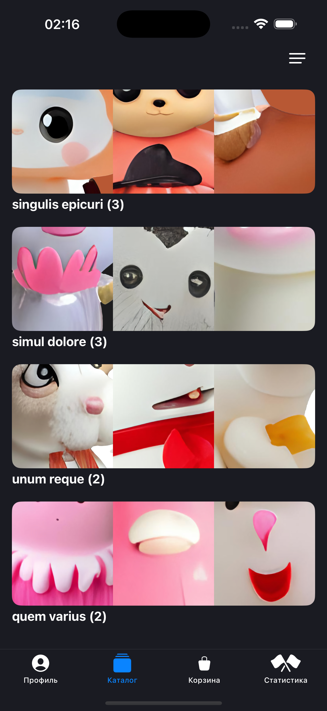
  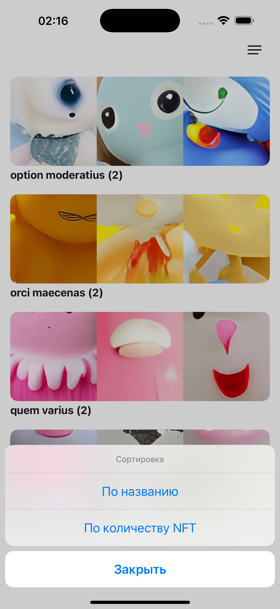
  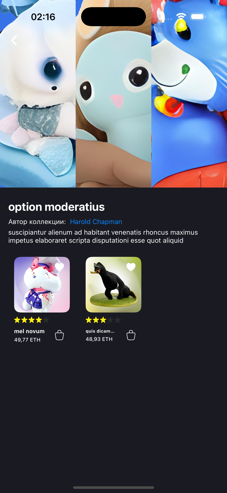

  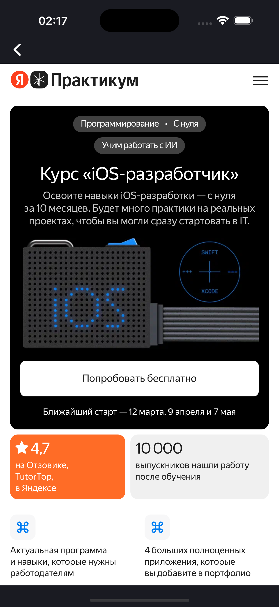
  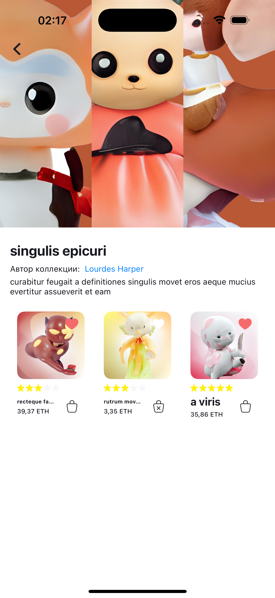
  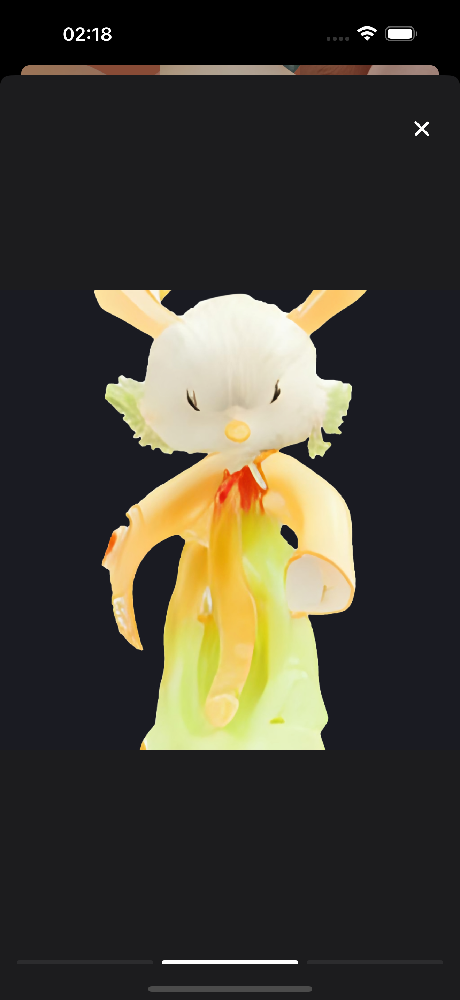

#### iOS 26

  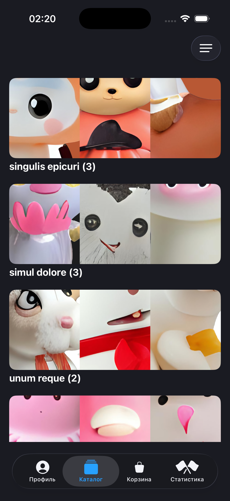
  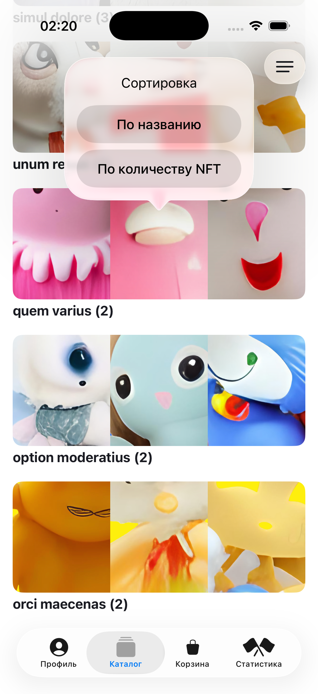
  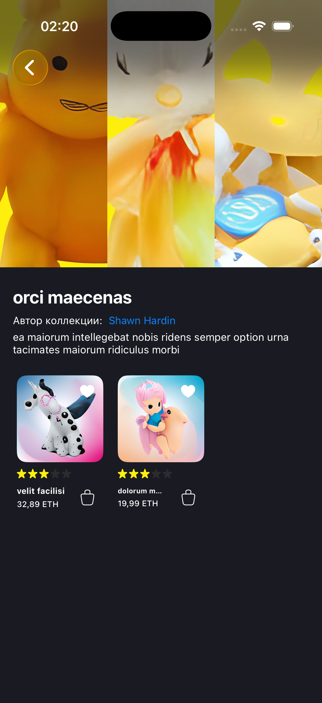

  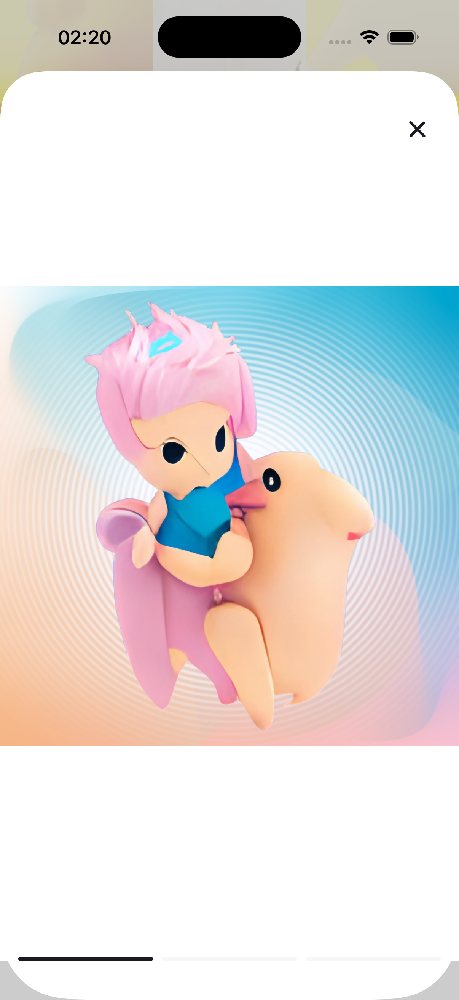
  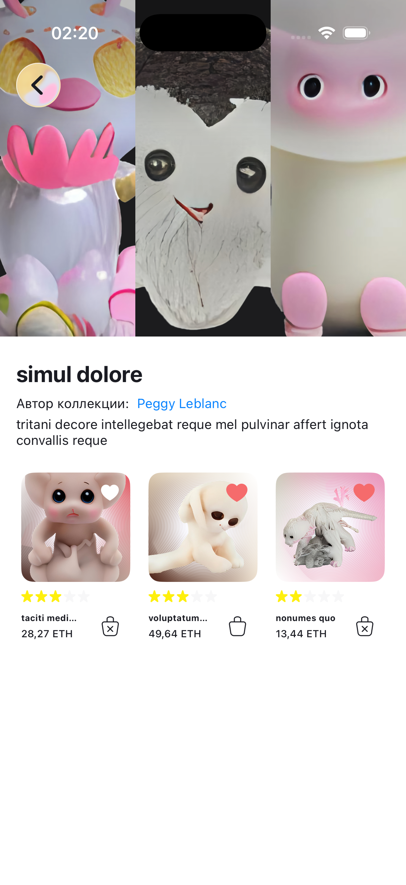
  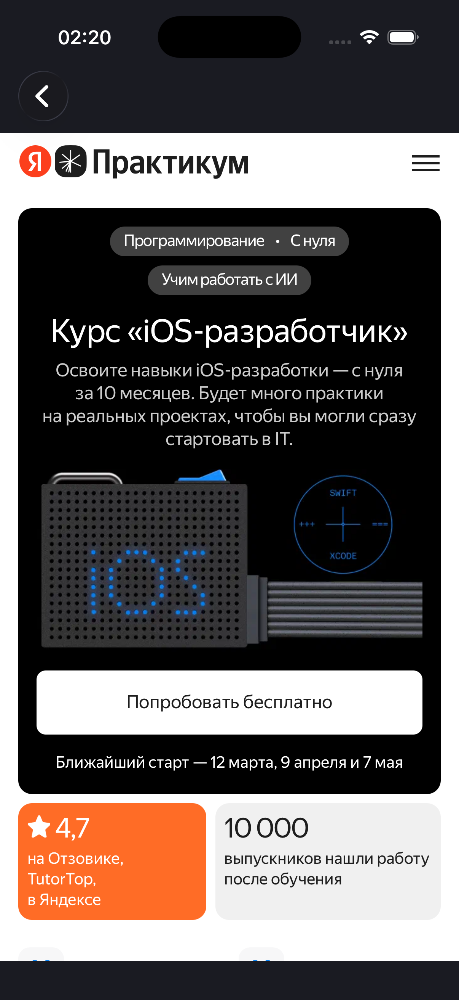

### Скринкаст
[Ссылка на скринкаст](https://disk.yandex.ru/i/sy3cax2fR824vA)

---

## Экран "Корзина"

### Статус
Выполнен ✅

### Краткое описание

- На экране Корзина пользователь может просмотреть список добавленных к покупке NFT и отредактировать его. Для списка доступны 3 опции сортировки: по цене, рейтингу и названию. Также пользователь может легко удалить предмет из корзины. 
- В нижней панели отображаются количество предметов и их общая стоимость. Кнопка «К оплате» ведёт на экран выбора способа оплаты. Покупатель может перейти к просмотру Пользовательского соглашения по нажатию на гиперссылку. 
- После выбора валюты для оплаты пользователь может оплатить заказ, после чего появляется экран с поздравлением с покупкой, а корзина пользователя очищается.

### Разработчик
- [Степан Чуйко](https://github.com/CaptainSharky)

### Скриншоты

  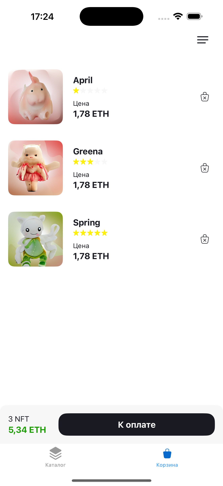
  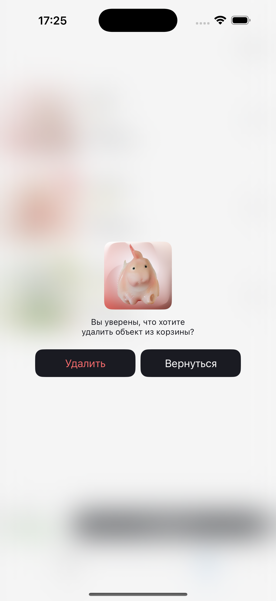
  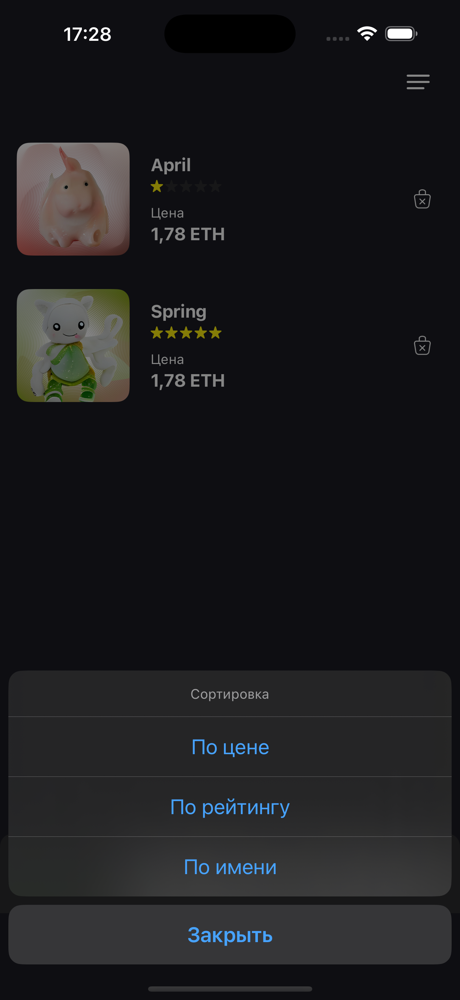

  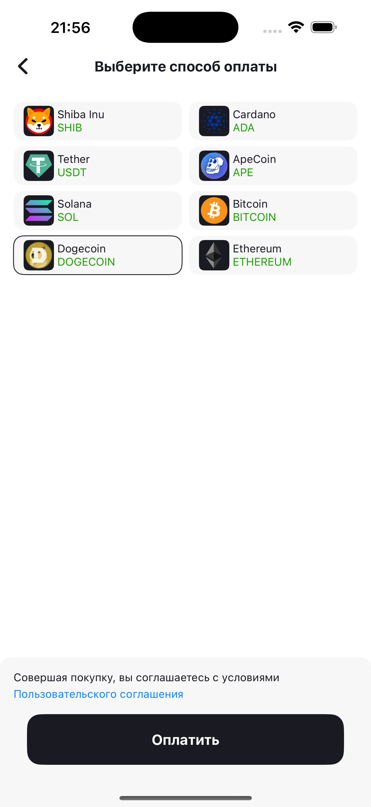
  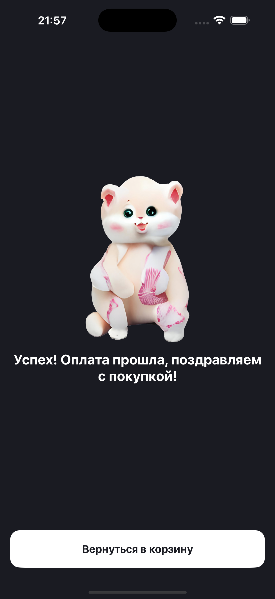
  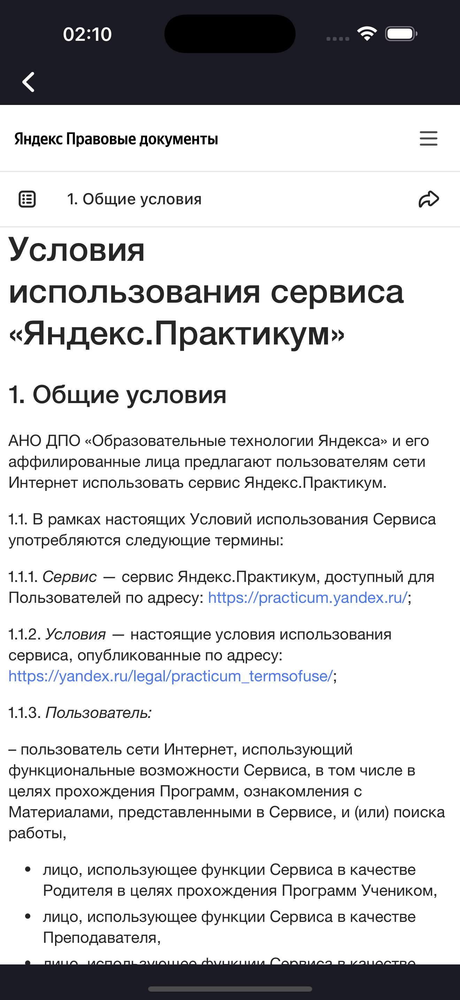

### Скринкаст
[Ссылка на скринкаст](https://drive.google.com/file/d/1DPiMEP2LH2pmjEzlmw47G1z4sSsldQZf/view)

---

## Экран "Статистика"

### Статус
Планируем доделать после сдачи 👀
